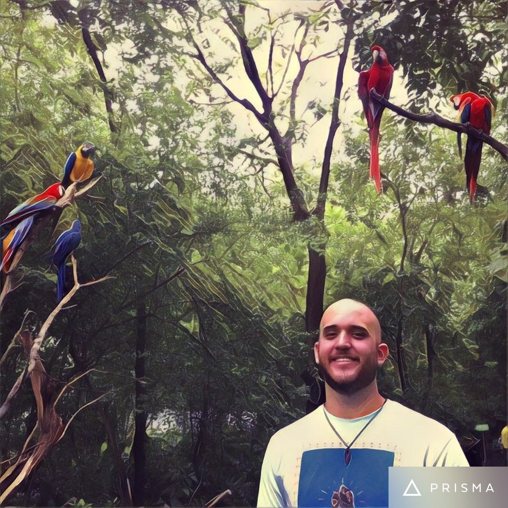

---
# You don't need to edit this file, it's empty on purpose.
# Edit theme's home layout instead if you wanna make some changes
# See: https://jekyllrb.com/docs/themes/#overriding-theme-defaults
layout: page
---

## About Me
I am a graduate student in mathematics at the [University of Michigan, Ann Arbor](http://www.lsa.umich.edu/math/). My research revolves around algebraic geometry.

My advisor is Mattias Jonsson.

**Email:** attilio (at) umich (dot) edu